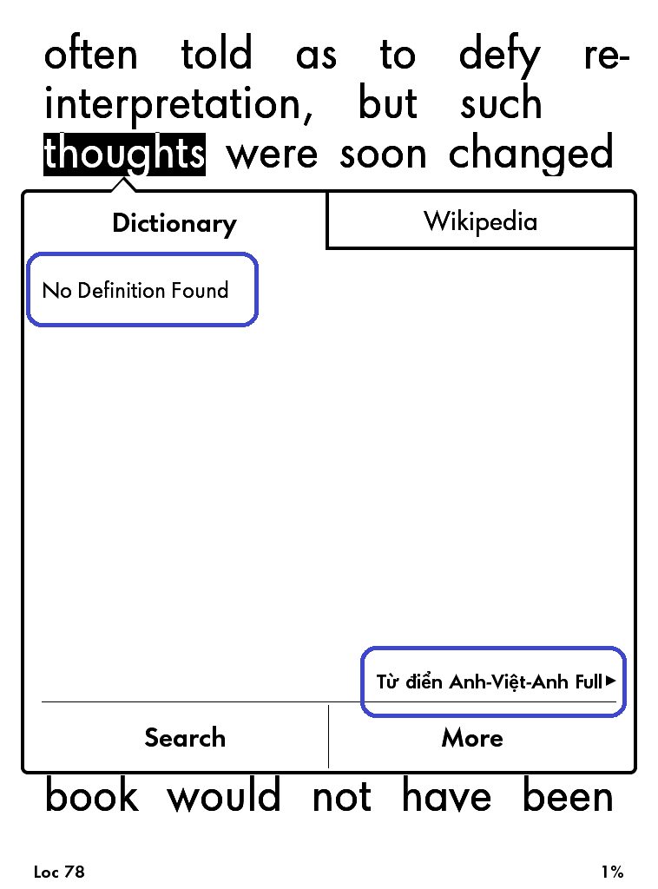
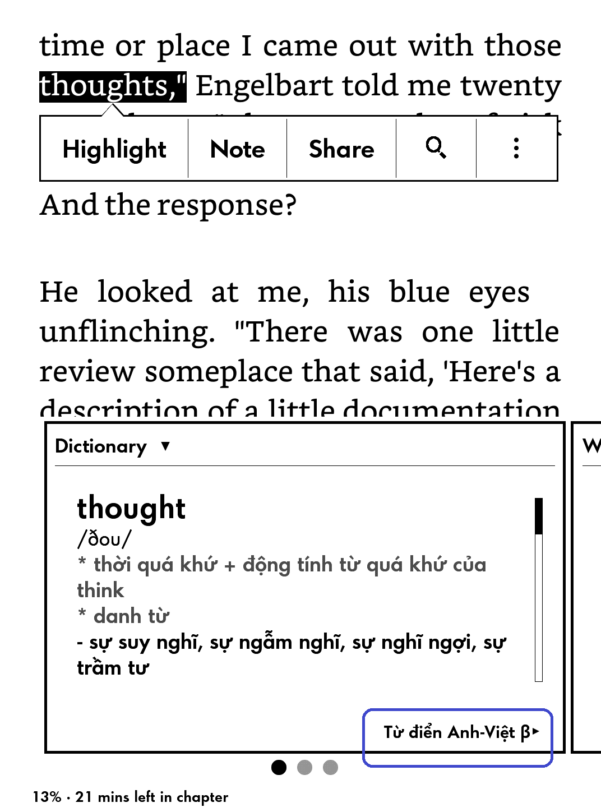

# catusf.github.io

## Hello, World!

It's good to be back.

## Từ điển tiếng Việt cho Kindle

Cho phép tra các dạng khác nhau của từ như số nhiều, các thời của động từ, v.v.

Hãy so sánh hai hình dưới đây.

Before applying my hack

After applying my hack

[Download](dict/TudienAnhVietBeta.mobi)

Để sử dụng chỉ cần copy vào thư mục `documents` trên Kindle. 
