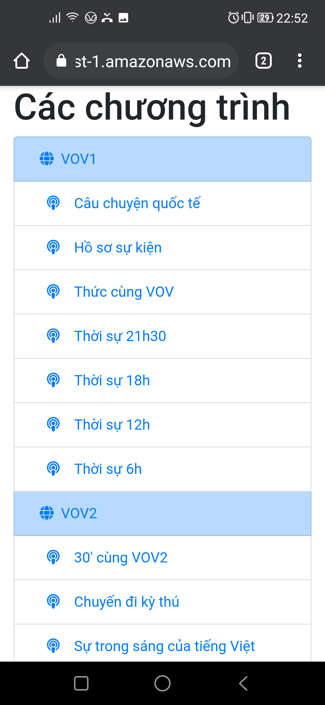
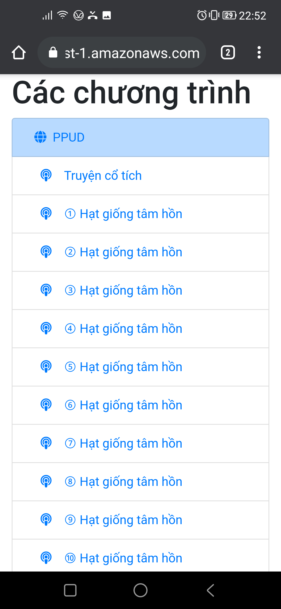
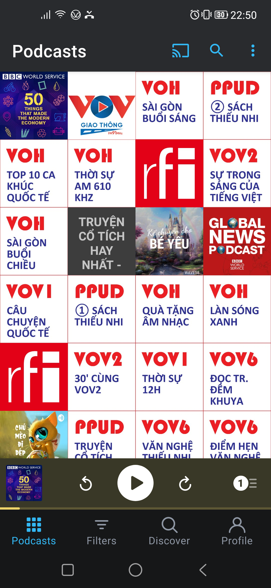
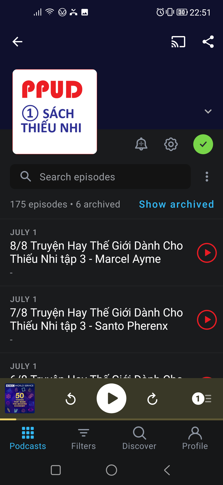
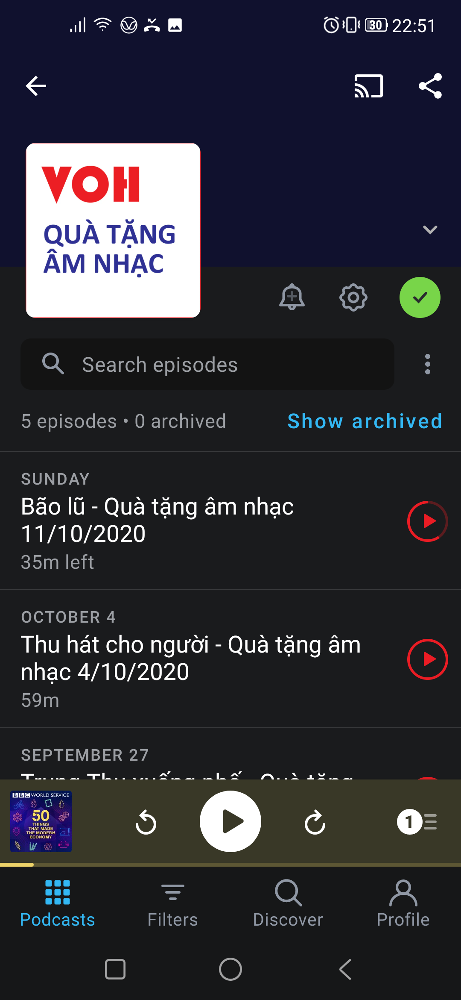
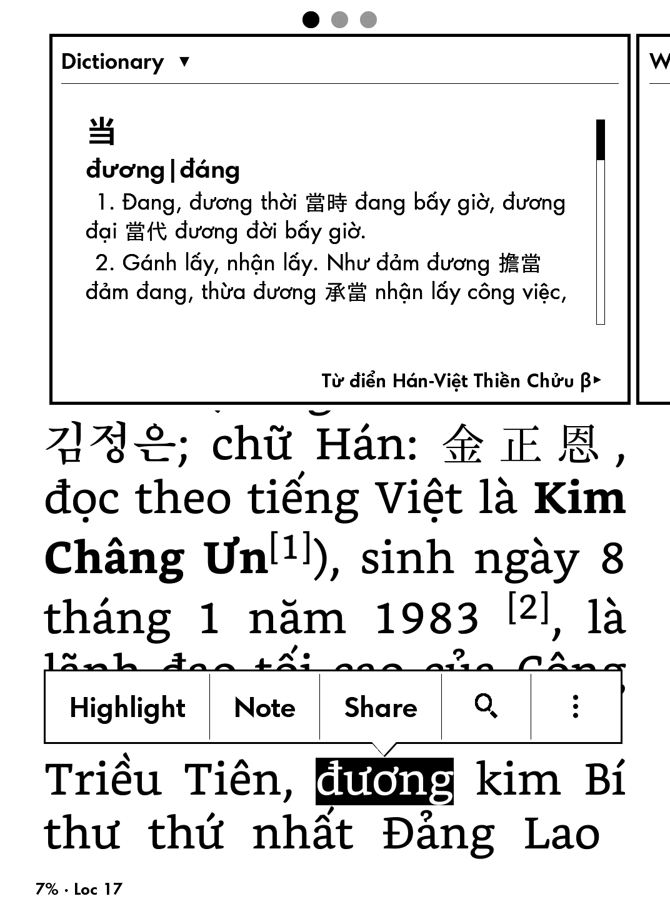
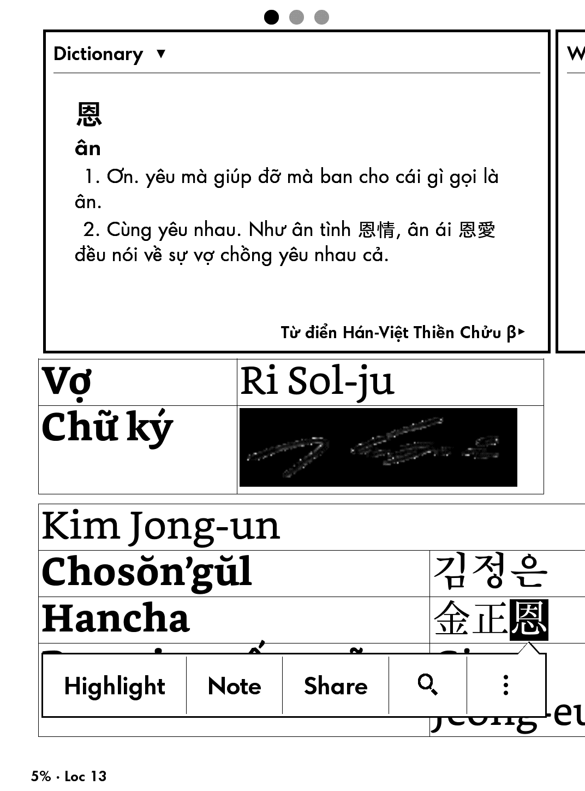

# Podcast tiếng Việt - Nghe lại các chương trình radio trên điện thoại
Dự án Radio2Podcasts này đọc thông tin từ các trang web có audio và chuyển thành các podcast để nghe trên lại điện thoại dễ dàng. Để nghe, hãy sử dụng các ứng dụng sau: 
- Trên iOS: [Apple Podcasts](https://apps.apple.com/us/app/apple-podcasts/id525463029) hay [Pocket Casts](https://apps.apple.com/au/app/pocket-casts/id414834813) 
- Trên Android: [Podcast Addict](https://play.google.com/store/apps/details?id=com.bambuna.podcastaddict&hl=en&gl=US) hay [Pocket Casts](https://play.google.com/store/apps/details?id=au.com.shiftyjelly.pocketcasts)

Sau khi cài đặt một trong các ứng dụng trên, truy cập vào một trong 2 trang sau:
- [Các chương trình radio](https://github.com/catusf/radio2podcasts/index.html)
- [Các cuốn sách nói](https://github.com/catusf/radio2podcasts/index-ppud.html)

Hiện nay các trang web hiện nay đã hỗ trợ:
- [VOV1](http://vov1.vn/) Đài tiếng nói Việt Nam
- [VOV6](http://vov6.vov.vn/) Đài tiếng nói Việt Nam
- [VOH](https://radio.voh.com.vn/) Đài tiếng nói Nhân dân TP HCM
- [DRT](http://www.drt.danang.vn/) Đài phát thanh truyền hình Đà Nẵng
- [Sách nói trên trang Phật pháp ứng dụng](https://phatphapungdung.com/sach-noi/)

## Một số hình ảnh

 

#### Giao diện nghe podcast

 

 

## Công nghệ
Ở Việt Nam, không nhiều trang web của các đài phát thanh cung cấp podcast để đọc giả nghe lại các chương trình. Dự án Radio2Podcasts này thực hiện những việc sau:
1. Chạy chương trình Python (triển khai trên Heroku) định kỳ hàng giờ
2. Tìm ra các audio mới trên các website
3. Tạo ra file XML có format của podcast
4. Tạo ra file HTML của tất cả các podcast vừa tạo ra
5. Lưu các file XML và HTML lên một trang web (hiện dùng trang GitHub Pages các bạn đang xem)

Nếu bạn muốn sửa lỗi hay thay đổi chương trình, hãy truy cập vào [github.com/catusf/radio2podcasts](https://github.com/catusf/radio2podcasts).

# Từ điển Hán - Việt [Thiền Chửu](https://vi.wikipedia.org/wiki/Thi%E1%BB%81u_Ch%E1%BB%ADu) cho Kindle

[Download Từ điển Hán - Việt Thiền Chửu v1.1](https://github.com/catusf/tudien/releases/download/v1.1/TudienThienChuu.mobi)

Cho phép tra từ theo âm Hán-Việt hoặc chữ Hán.

Tra theo âm Hán-Việt

Tra theo chữ Hán

# Từ điển Anh - Việt cho Kindle

[Download Từ điển Anh - Việt v1.1](https://github.com/catusf/tudien/releases/download/v1.1/TudienAnhVietBeta.mobi)

Cho phép tra các dạng khác nhau của từ như số nhiều của danh từ, các thời của động từ, v.v.

Hãy so sánh hai hình dưới đây.

Trước đây

Bây giờ

Để sử dụng chỉ cần copy vào thư mục `documents` trên Kindle. 

## Đóng góp

Nếu bạn muốn sửa lỗi hay tự sửa đổi nội dung của từ điển, hãy truy cập vào [github.com/catusf/tudien](https://github.com/catusf/tudien).
